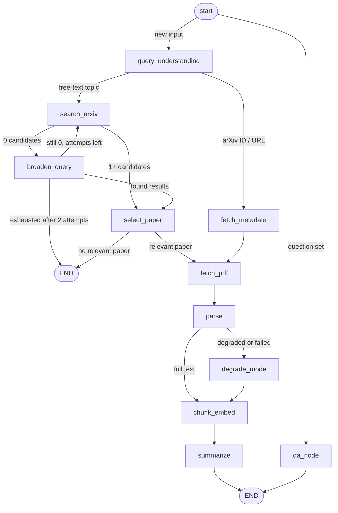

# arXiv Digest Agent

An agent that takes a research topic or an arXiv ID/URL, fetches and parses the paper, writes a structured executive briefing, and then answers follow-up questions about the paper. Answers are grounded in retrieved chunks and carry citations; if the paper doesn't cover the question, the agent says so instead of guessing.

It is built as an explicit LangGraph state graph with a persistent session store, and runs from a CLI.

## Architecture

The graph has one entry node (`start`) that routes either to the digest pipeline (new input) or straight to Q&A (a question on an existing session).



This is a simplified version of the graph generated from the compiled LangGraph; the generated diagram, a per-node state table and the failure-paths table are in [docs/architecture.md](docs/architecture.md).

### State

`AgentState` is a `TypedDict`. Nodes return only the keys they change.

| Field | Type | Written by | Reducer |
|---|---|---|---|
| `raw_input` | str | CLI input | replace |
| `intent` | paper_lookup / topic_search / unclear | query_understanding | replace |
| `arxiv_id` | str or None | query_understanding | replace |
| `search_query` | str or None | query_understanding, broaden_query | replace |
| `queries_tried` | list[str] | broaden_query | replace |
| `candidates` | list[dict] | fetch_metadata, search_arxiv, broaden_query | replace |
| `selection_reason` | str or None | select_paper | replace |
| `paper` | dict or None | fetch_metadata, select_paper | replace |
| `pdf_path` | str or None | fetch_pdf | replace |
| `sections`, `full_text` | list[dict], str | parse, degrade_mode | replace |
| `parse_mode` | full / degraded_abstract_only / failed | parse | replace |
| `collection`, `n_chunks` | str, int | chunk_embed | replace |
| `briefing` | dict or None | summarize | replace |
| `question` | str or None | CLI input | replace |
| `retrieved` | list[dict] | qa_node | replace |
| `messages` | list[dict] | qa_node | `operator.add` |
| `errors`, `warnings` | list | any node | `operator.add` |
| `retries` | dict[str, int] | broaden_query, fetch_pdf | replace (nodes return the full updated dict) |

### How state persists

- The graph is compiled with a `SqliteSaver` checkpointer (`.data/sessions.sqlite`), so state survives between CLI processes.
- `thread_id` is the arXiv ID when the input contains one. For a topic search the ID is unknown until a paper is selected, so the thread is `topic:<slug of the input>`.
- Chunks and embeddings live in a local Chroma store (`.data/chroma`), one collection per paper.
- `ask <thread_id> "..."` re-attaches to the saved thread and runs only `start` and `qa_node`. It does not re-fetch, re-parse or re-embed. Re-running `digest` on the same thread does redo the digest.

## Setup

Requires Python 3.12 (developed on Windows with Python 3.12).

```bash
make install            # Windows without make: python make.py install
cp .env.example .env    # then edit .env, see "LLM provider" below
```

Without `make`, run `pip install -e ".[dev]"`. The first run downloads the embedding model (roughly 130 MB) from Hugging Face, so it needs internet access.

### LLM provider

Pick one and set it in `.env` (or in the environment).

**Groq (free tier, needs a free API key)**
```bash
LLM_PROVIDER=groq
GROQ_API_KEY=<your key>
```
The model is `openai/gpt-oss-120b`.

**Ollama (local, no API key)**
```bash
ollama pull qwen2.5:7b-instruct
ollama serve
LLM_PROVIDER=ollama
```

## Usage

```bash
python -m agent.cli digest 2401.12345 --auto --no-qa                   # briefing for one paper
python -m agent.cli digest "KV-cache compression for LLMs" --auto --no-qa   # topic search
python -m agent.cli digest 2401.12345 --auto                           # briefing, then an interactive Q&A prompt
python -m agent.cli ask 2401.12345 "What datasets did they evaluate on?"
python -m agent.cli sessions                                           # list saved sessions
```

Useful flags: `--verbose` prints every node transition, `--json-out FILE` writes the briefing JSON, `--provider {groq,gemini,ollama}` overrides the provider. `--model` only applies to Ollama, and `--top-k` is accepted but currently ignored (see Known limitations).

Every `digest` run also writes the briefing to `examples/briefing_<arxiv_id>.json`.

### Tests and demo

```bash
make test       # Windows without make: python make.py test   (or: python -m pytest -q)
make demo       # digest, one in-paper question, one off-topic question
```

The unit tests run offline: the network is blocked, and the LLM, arXiv client and embedding model are stubbed.

## Example run

Real output from `LLM_PROVIDER=groq`, started from an empty session store. The full transcript is in [examples/sample_session.md](examples/sample_session.md).

**Input**
```
$ python -m agent.cli digest 2401.12345 --auto --no-qa
```

**Briefing**
```
PyMuPDF parsing degraded, trying pdfplumber fallback
                   Distributionally Robust Receive Combining

Authors: Shixiong Wang, Wei Dai, Geoffrey Ye Li
Published: 2024-01-22T20:20:48Z
Categories: eess.SP
arXiv: 2401.12345 | PDF

-------------------------------------------------------------------------------

Why It Matters

The paper introduces a unified, distributionally robust framework for
receive‑combining that remains reliable even when key system parameters such as
channel state, noise statistics, and transmit‑signal covariance are uncertain
or estimated from limited pilot data. By encompassing many classic combiners
(ZF, MMSE, MVDR, etc.) as special cases and integrating modern
neural‑network‑based receivers, the work promises more dependable wireless
links in realistic, imperfect environments, which is critical for
next‑generation communication systems that must operate under tight latency,
hardware, and training‑data constraints.

Problem Statement

The authors address the challenge of accurately estimating transmitted signals
in wireless systems when the underlying statistical models (channel matrix,
noise covariance, transmit‑signal covariance, etc.) are uncertain or only
partially known, and when only a small number of pilot samples are available
for training.

Method

 • Under technical conditions, the original optimization problem is
   upper‑bounded by a spectral‑norm‑regularized empirical risk minimization
   (ERM) problem for any matrix norm, guaranteeing global optimality in
   reproducing‑kernel Hilbert spaces (RKHSs).
 • Corollary 5 shows that the regularized ERM problem is equivalent to a
   Tikhonov (trace) regularizer, which reduces to ridge regression or kernel
   ridge regression when the second‑order moment of the data‑perturbation
   vector Δ is bounded by εF.
 • For wireless‑signal neural‑network training, norm regularization is
   recommended because norms on real spaces are equivalent, allowing the bound
   to be further tightened by the estimated channel matrix Ĥ.
 • The covariance matrix of the transmitted signal is estimated by the sample
   covariance R̂ = S Sᴴ / L, and the channel matrix is estimated via
   minimum‑mean‑square‑error as Ĥ = X Sᴴ (S Sᴴ)⁻¹.
 • The estimated matrices R̂_s, Ĥ, and R̂_v are then used in beamformers such as
   Wiener and Capon, while acknowledging that they remain uncertain relative to
   the true (possibly time‑varying) matrices.

Key Results

 • Diagonal‑loading operations significantly improve estimation performance,
   especially when the pilot data size is relatively small. (Evidence: Table
   II, Section: experiments)
 • Kernel‑DL achieves lower MSE than linear beamformers (e.g., Wnr‑DL MSE =
   1.23 vs. Wnr MSE = 1.38), whereas the non‑robust Kernel method can suffer
   numerical instability during kernel‑matrix inversion. (Evidence: experiments
   section, Section: experiments)
 • Increasing the number of receive antennas while keeping the number of
   transmit antennas fixed reduces MSE, demonstrating the benefit of antenna
   diversity. (Evidence: Fig. 2a vs 2c, Section: results)
 • Higher SNR leads to lower MSE for a given antenna configuration. (Evidence:
   Fig. 2c vs 2d, Section: results)
 • When the covariance matrix R_v is known, the Wiener‑CE beamformer
   outperforms the standard Wiener beamformer by exploiting the linear signal
   model in addition to pilot data. (Evidence: Fig. 2b, Section: results)

Limitations

 • Not explicitly stated by the authors; reviewer-inferred: the framework
   relies on accurate estimation of covariance and channel matrices, so
   performance may degrade in highly non‑stationary or rapidly time‑varying
   channels where these estimates become stale.

Follow-up Questions

 1 How does the proposed distributionally robust framework perform under severe
   model mismatch, such as non‑Gaussian noise or hardware impairments beyond
   power‑amplifier non‑ideality?
 2 Can the spectral‑norm‑regularized ERM formulation be extended to jointly
   optimize pilot placement and training length for further robustness?
 3 What is the computational complexity of Kernel‑DL in large‑scale antenna
   arrays, and can approximate kernel methods (e.g., random Fourier features)
   retain robustness while reducing cost?
 4 How does the method adapt to online or streaming scenarios where channel
   statistics evolve and pilot data must be incorporated incrementally?
 5 Is it possible to integrate the robust receive‑combining approach with
   multi‑user MIMO scheduling to jointly mitigate inter‑user interference and
   estimation uncertainty?

-------------------------------------------------------------------------------

Generated by arXiv Digest Agent

Session saved. Thread ID: 2401.12345
Use 'python -m agent.cli ask 2401.12345 "your question"' to ask questions
```

**Q&A** (each answer cites the chunks it came from; the second question relies on the first)
```
$ python -m agent.cli ask 2401.12345 "Which beamformers did they compare?" --verbose
node=start
node=qa_node

They compared several beamformers: Wiener, Wiener‑DL (Wiener with diagonal
loading), Wiener‑DR (distributionally robust Wiener), Wiener‑CE
(channel‑estimation‑based Wiener), Wiener‑CE‑DL, Wiener‑CE‑DR, Capon, Capon‑DL,
Zero‑forcing (ZF), Kernel, and Kernel‑DL.

Citations:
  • experiments, p.?  (2401.12345:40)
  • experiments, p.?  (2401.12345:43)
```
```
$ python -m agent.cli ask 2401.12345 "Which of them suppresses outliers best?" --verbose
node=start
node=qa_node

The robust Kernel‑DL beamformer (Kernel‑DL) suppresses outliers best, as it
consistently outperforms all other beamformers.

Citations:
  • experiments, p.?  (2401.12345:42)
```

**Off-topic question**
```
$ python -m agent.cli ask 2401.12345 "What does this paper say about the 2026 World Cup?"
That isn't covered in this paper.
```

## Failure handling

| Situation | What happens |
|---|---|
| arXiv returns zero results | `broaden_query` relaxes the query up to twice (attempt 1: drop the category filter and quotes and turn AND into OR; attempt 2: keep the two longest terms). If it is still empty, the run stops with `ZERO_RESULTS_EXHAUSTED`, which lists every query tried and suggests a next step, and exits with code 1. Checked against real arXiv with a nonsense query |
| Results exist but none is relevant | `select_paper` asks the LLM to rate each candidate against what the user typed and drops any below 4/10 before ranking. If none is left, the run stops with `NO_RELEVANT_PAPER`, which names the closest match, and exits with code 1 instead of digesting a bad match. Checked against real arXiv with an off-topic query |
| PDF fails to parse cleanly | PyMuPDF falls back to pdfplumber; if both fail, `parse_mode` becomes `degraded_abstract_only`, the text is seeded from the abstract, and a warning is recorded. A briefing is still produced |
| The question is not covered by the paper | If the best retrieved chunk is farther than `ABSTAIN_MAX_DISTANCE` (0.45), the agent returns "That isn't covered in this paper." without calling the LLM |
| The LLM answer has no valid citation | Citations must map to retrieved chunks. An answer with none is replaced by the same abstain message |
| Provider rate limit (HTTP 429) | The client waits for the time the provider reports and re-sends the same request, up to 4 times. A wait longer than 60 seconds (a quota reset) fails with the provider's message |
| `ask` on an unknown session | One clear line, "No saved session for X - run digest first", and a non-zero exit code |

Zero results, irrelevant matches, parse degradation, the abstain gate, citation validation, multi-turn history and rate-limit handling are covered by automated tests (`python -m pytest -q`).

## Rate limits and provider notes

- On Groq's free tier, `openai/gpt-oss-120b` allows about 8,000 tokens per minute. A `digest` can use half of that or more, and a single `ask` requests about 4,000 tokens, so commands run back to back can hit the limit. The client waits for the reset time Groq reports (usually a few seconds) and retries. Use `LLM_PROVIDER=ollama` to avoid limits.
- Provider model names change. If a call fails with a 404 or `model_not_found`, check the provider's current model list before assuming a code bug.

### Provider verification

| Provider | Model | Status |
|---|---|---|
| Groq | `openai/gpt-oss-120b` | Verified: the example session above (`digest`, two `ask` turns, an abstained question and `sessions`) ran on Groq |
| Ollama | `qwen2.5:7b-instruct` | Ran successfully in earlier sessions: `examples/briefing_1706_03762.json` and `examples/briefing_2609_07966.json` (a topic search) were generated with it. It crashed once on Windows with a CUDA stack-buffer-overrun error |
| Gemini | `gemini-1.5-flash` | Not verified: the code uses the deprecated `google.generativeai` SDK |

## Design decisions and tradeoffs

- **Explicit graph with a checkpointer.** Every stage is a node, and routing is done by small, testable functions. `SqliteSaver` plus `thread_id` gives sessions that survive process restarts, so `ask` never repeats the expensive fetch, parse and embed steps.
- **Grounded Q&A.** Retrieve the top 20 chunks, rerank with MMR (lambda 0.6), and keep 6. The prompt labels them `[S1]` to `[S6]`, and the `[Sn]` labels are mapped back to real chunk IDs in code, so the LLM's own citation fields are never trusted. Unknown labels are dropped.
- **Distance-based abstain gate.** The first attempt used a similarity gate (`1 - distance < 0.35`) that never fired, because bge-small distances are compressed. The gate now uses the raw best cosine distance with `ABSTAIN_MAX_DISTANCE=0.45`. On the two papers checked, the closest in-paper question had a best distance of at most 0.413 and the closest off-topic question at least 0.488, so 0.45 sits in the gap. That is a small sample, so treat it as a starting point.
- **Relevance floor before ranking.** The composite selection score (0.6 LLM relevance, 0.25 recency, 0.15 full-text availability) gives any recent paper 4 of 10 points for free, so it cannot tell "relevant" from "newest". Candidates below 4/10 LLM relevance are dropped before ranking. The threshold was set by hand and checked on a handful of queries.
- **Rewrite only for follow-ups.** A question is rewritten with history only if it is short (5 words or fewer) or contains a reference word such as "it" or "they". Standalone questions go through verbatim; otherwise the rewrite pulled earlier topics into an off-topic question and defeated the abstain gate. The rewrite prompt asks for a short noun phrase instead of copying lists from the history, the history it sees is clipped, and a rewrite that is empty or longer than 30 words is discarded in favour of the original question. Without that guard, a follow-up about "them" once became a query listing eleven method names and retrieval was pulled toward a results table.
- **Section-aware chunking at 400/80 tokens.** bge-small has a 512-token window and silently truncates longer input, so chunks stop at 400 tokens with 80 tokens of overlap and never cross a section boundary.
- **Local embeddings** (`BAAI/bge-small-en-v1.5` via sentence-transformers): no API key, fast on CPU, 384 dimensions.
- **PDF fallback chain.** PyMuPDF first, then pdfplumber. Repeated blocks that two-column LaTeX layouts produce are removed before chunking, because they otherwise degrade retrieval quality without any visible error.
- **State rules that came from real bugs.** Only `messages`, `errors` and `warnings` use `operator.add`; every other field is replaced by its last writer. Two consequences: a pass-through node must return `{}` and never echo the state (echoing it re-appended the message history on every turn), and any key a node returns must be declared in `AgentState`, because LangGraph silently drops undeclared keys (this is how `retries` was lost and the zero-result loop never ended).
- **Tests are checked by breaking the code.** I reintroduced thirteen bugs one at a time (the start-node echo, history spread on two return paths, a disabled abstain gate, a reversed `[Sn]` map, mis-wired graph edges, broken rate-limit waiting, a disabled relevance floor, an undeclared state key) and confirmed a specific test failed each time. The graph-level zero-result test found the real `retries` bug. Two other bugs, in query broadening, only showed up in real runs against arXiv and now have unit tests.
- **Gemini left unverified.** Groq and Ollama already meet the no-paid-key constraint, and the Gemini path uses a deprecated SDK, so I documented it as unverified rather than claiming it works.

## Known limitations

- Citation `section` labels can be wrong, and `page` is 0 on the pdfplumber path.
- Briefing `evidence` figure and table references vary between LLM runs, and the synthesis step can attach a number to the wrong method (in one captured run a Wiener-DL versus Wiener comparison was attributed to Kernel-DL). Check figures against the paper.
- Answers stay within the retrieved text but can state a claim more strongly than the paper does.
- Text extracted from math-heavy PDFs can be garbled (missing spaces, `(cid:...)` tokens). The example paper triggers the pdfplumber fallback, and some of its chunks are hard to read, which weakens retrieval and answers.
- The abstain threshold was calibrated on two papers only, and the relevance floor was set by hand.
- Topic search always auto-selects the top-ranked paper. `--auto` is accepted but has no effect, and there is no interactive selection.
- A pronoun follow-up right after an abstained question can be rewritten toward the off-topic subject and abstain too.
- Questions about paper metadata ("what is the title") abstain, because chunks hold body text only.
- `--top-k` has no effect: `qa_node` uses fixed values (6 chunks, MMR lambda 0.6).
- Windows Ollama crashed once with a CUDA error in the development environment.
- After a failed broadening the same search runs again, so two attempts cost five arXiv calls.

## What I'd do next

1. Index a header and abstract chunk so metadata questions work.
2. Read `top_k` and the MMR lambda from settings in `qa_node` instead of hardcoding them.
3. Add interactive selection for topic searches, and calibrate the relevance floor on more queries.
4. Calibrate the abstain threshold on more papers from different fields.
5. Skip the repeated search after a failed broadening.
6. Verify a Gemini path with the current `google-genai` SDK.
7. Add integration tests that replay recorded arXiv responses.