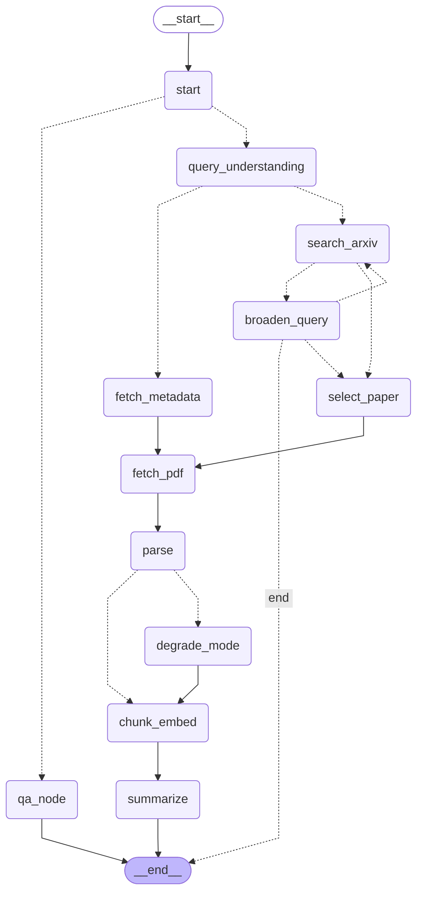

# Architecture — arXiv Digest Agent

## Mermaid Graph

## State Table

Every `AgentState` field, its type, which node writes it, and which fields have `operator.add` reducers:

| Field | Type | Written by | Reducer |
|---|---|---|---|
| `raw_input` | `str` | `_start` / `query_understanding` | — |
| `intent` | `Literal["paper_lookup","topic_search","unclear"]` | `query_understanding` | — |
| `arxiv_id` | `str \| None` | `query_understanding` | — |
| `search_query` | `str \| None` | `query_understanding`, `broaden_query` | — |
| `candidates` | `list[dict]` | `search_arxiv`, `broaden_query`, `fetch_metadata` | `operator.add` |
| `selection_reason` | `str \| None` | `select_paper` | — |
| `paper` | `dict \| None` | `fetch_metadata`, `select_paper` | — |
| `pdf_path` | `str \| None` | `fetch_pdf` | — |
| `sections` | `list[dict]` | `parse`, `degrade_mode` | `operator.add` |
| `full_text` | `str \| None` | `parse`, `degrade_mode` | — |
| `parse_mode` | `Literal["full","degraded_abstract_only","failed"]` | `parse`, `degrade_mode` | — |
| `collection` | `str \| None` | `chunk_embed` | — |
| `n_chunks` | `int` | `chunk_embed` | — |
| `briefing` | `dict \| None` | `summarize` | — |
| `question` | `str \| None` | `cli.py` (invoke input) | — |
| `retrieved` | `list[dict]` | `qa_node` | `operator.add` |
| `errors` | `Annotated[list[dict], operator.add]` | Various nodes | `operator.add` |
| `warnings` | `Annotated[list[str], operator.add]` | Various nodes | `operator.add` |
| `messages` | `Annotated[list[dict], operator.add]` | `qa_node` | `operator.add` |

Fields with `operator.add` reducers: `candidates`, `sections`, `errors`, `warnings`, `messages`, `retrieved`.

## How State Persists

### Thread ID choice
- When the input contains an arXiv ID (e.g. `2401.12345`), `thread_id = "2401.12345"`.
- When the input is a topic search, `thread_id = "topic:<slug of the input>"` (e.g. `topic:recent-work-on-kv-cache-compression-for-llms`). This is computed in `cli.py`'s `_get_thread_id()`.

### SqliteSaver at `.data/sessions.sqlite`
The graph is compiled with `SqliteSaver.from_conn_string(str(settings.sqlite_db_path))`. Every node return value is checkpointed. A subsequent `ask` on the same `thread_id` restores the full state (including `paper`, `collection`, `messages`) from the checkpointer — so QA re-attaches to a previous session without re-parsing.

### Chroma at `.data/chroma`
Chunk embeddings are stored in ChromaDB collections named `paper_{arxiv_id_safe}`. The collection is created by `vectorstore.get_collection()`, which pins `BAAI/bge-small-en-v1.5` embeddings.

### What a re-attached `ask` does and does not re-run
- **Does re-run:** `qa_node` only — retrieves chunks, runs the abstain gate, generates the answer.
- **Does NOT re-run:** `query_understanding`, `search_arxiv`, `fetch_metadata`, `fetch_pdf`, `parse`, `chunk_embed`, `summarize`. The paper metadata, parsed sections, and vector collection are all restored from the checkpoint and ChromaDB.

## Failure Paths

| Failure path | State key | Error code | Behavior |
|---|---|---|---|
| Zero results → broaden | `candidates`, `retries.broaden_query`, `search_query` | `ZERO_RESULTS_EXHAUSTED` | `broaden_query` runs at most twice; after 2 attempts, `_should_continue_broaden` returns `"end"` |
| Parse quality gate → degrade_mode | `parse_mode` | — | `parse` returns `parse_mode="degraded_abstract_only"`, `_route_parse_quality` routes to `degrade_mode` |
| JSON repair loop | `briefing` | `ValidationError` | `summarize` catches `ValidationError`/`json.JSONDecodeError`, re-prompts once, falls back to Markdown on second failure |
| Abstain gate | `messages` | — | `best_distance > abstain_max_distance` → return canned message without LLM call |
| No valid citations | `messages` | — | LLM answer with no valid citations → return canned abstain message |
| LLM provider failure | `errors` | `QA_FAILED` | `qa_node` catches exception, returns error dict; no traceback to user |

## Verified Behavior

All failure paths above were verified through real runs and unit tests. The abstain gate was calibrated on two papers (2401.12345 and 1706.03762): worst in-paper best distance 0.413, best off-topic distance 0.488, yielding `ABSTAIN_MAX_DISTANCE=0.45` (§11 Stage 7).

The query rewrite only fires for follow-ups (≤5 words or containing reference words). An off-topic question ("what does this say about the 2026 World Cup?") returns the abstain message without calling the LLM. A pronoun follow-up ("How does it compare to the Wiener beamformer?") is rewritten using conversation history before retrieval.
