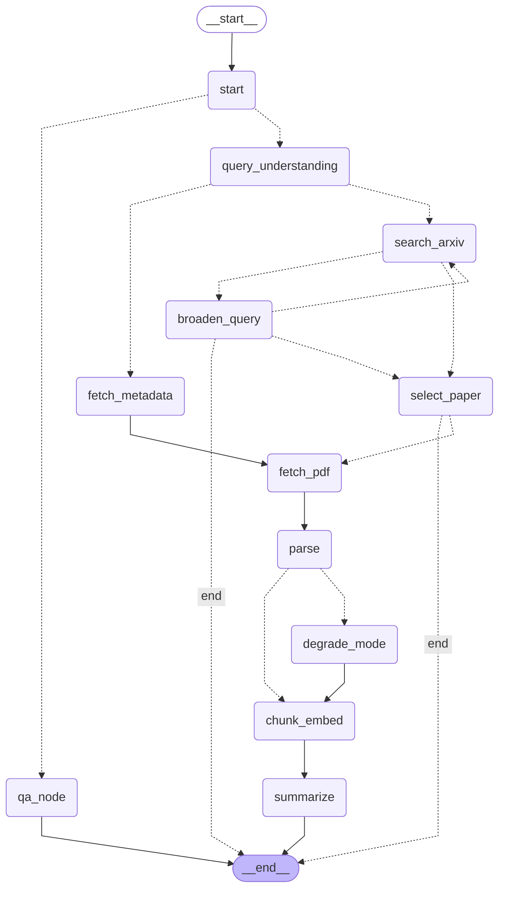

# Architecture — arXiv Digest Agent

## Mermaid Graph

Generated from the compiled LangGraph with `build_graph().get_graph().draw_mermaid()`. Dotted edges are conditional routes.

## State Table

Every `AgentState` field, its type, which node writes it, and whether it has a reducer.

| Field | Type | Written by | Reducer |
|---|---|---|---|
| `raw_input` | `str` | `cli.py` (invoke input) | replace |
| `intent` | `Literal["paper_lookup","topic_search","unclear"]` | `query_understanding` | replace |
| `arxiv_id` | `str \| None` | `query_understanding` | replace |
| `search_query` | `str \| None` | `query_understanding`, `broaden_query` | replace |
| `queries_tried` | `list[str]` | `broaden_query` | replace |
| `candidates` | `list[dict]` | `search_arxiv`, `broaden_query`, `fetch_metadata` | replace |
| `selection_reason` | `str \| None` | `select_paper` | replace |
| `paper` | `dict \| None` | `fetch_metadata`, `select_paper` | replace |
| `pdf_path` | `str \| None` | `fetch_pdf` | replace |
| `sections` | `list[dict]` | `parse`, `degrade_mode` | replace |
| `full_text` | `str \| None` | `parse`, `degrade_mode` | replace |
| `parse_mode` | `Literal["full","degraded_abstract_only","failed"]` | `parse`, `degrade_mode` | replace |
| `collection` | `str \| None` | `chunk_embed` | replace |
| `n_chunks` | `int` | `chunk_embed` | replace |
| `briefing` | `dict \| None` | `summarize` | replace |
| `question` | `str \| None` | `cli.py` (invoke input) | replace |
| `retrieved` | `list[dict]` | `qa_node` | replace |
| `errors` | `list[dict]` | various nodes | `operator.add` |
| `warnings` | `list[str]` | various nodes | `operator.add` |
| `messages` | `list[dict]` | `qa_node` | `operator.add` |
| `retries` | `dict[str, int]` | `broaden_query`, `fetch_pdf` | replace (nodes return the full updated dict) |

Only `errors`, `warnings` and `messages` use `operator.add`; every other field is replaced by its last writer. Two rules follow from this:

- A pass-through node (`_start`) must return `{}`. Echoing the state back would re-append the checkpointed lists on every invoke.
- Every key a node returns must be declared in `AgentState`. LangGraph silently drops undeclared keys, which is how `retries` was once lost and the zero-result loop never ended.

## How State Persists

### Thread ID choice
- When the input contains an arXiv ID (e.g. `2401.12345`), `thread_id = "2401.12345"`.
- When the input is a topic search, `thread_id = "topic:<slug of the input>"` (e.g. `topic:kv-cache-compression-for-llms`). This is computed in `cli.py`'s `_get_thread_id()`.

### SqliteSaver at `.data/sessions.sqlite`
The graph is compiled with `SqliteSaver.from_conn_string(str(settings.sqlite_db_path))`. Every node return value is checkpointed. A later `ask` on the same `thread_id` restores the full state (including `paper`, `collection`, `messages`) from the checkpointer, so QA re-attaches to a previous session without re-parsing.

### Chroma at `.data/chroma`
Chunk embeddings are stored in ChromaDB collections named `paper_{arxiv_id_safe}`. The collection is created by `vectorstore.get_collection()`, which pins `BAAI/bge-small-en-v1.5` embeddings.

### What a re-attached `ask` does and does not re-run
- **Does run:** `start` and `qa_node`. It retrieves chunks, applies the abstain gate and generates the answer.
- **Does not run:** `query_understanding`, `search_arxiv`, `fetch_metadata`, `fetch_pdf`, `parse`, `chunk_embed`, `summarize`. The paper metadata, parsed sections and vector collection are restored from the checkpoint and ChromaDB.

## Failure Paths

| Failure path | State key | Error code | Behavior |
|---|---|---|---|
| Zero results → broaden | `candidates`, `retries`, `search_query`, `queries_tried` | `ZERO_RESULTS_EXHAUSTED` | `broaden_query` runs at most twice: attempt 1 drops the category filter and quotes and turns AND into OR, attempt 2 keeps the two longest terms. After two failed attempts it clears `search_query`, `_should_continue_broaden` returns `"end"`, and the error lists every query tried and suggests a next step. The CLI exits with code 1 |
| No relevant paper | `paper`, `selection_reason` | `NO_RELEVANT_PAPER` | `select_paper` drops candidates below 4/10 LLM relevance (judged against what the user typed) before ranking. If none is left it returns `paper=None`, and `_route_after_selection` ends the run instead of calling `fetch_pdf`. The CLI exits with code 1 |
| Parse quality gate → degrade_mode | `parse_mode` | — | `parse` returns `parse_mode="degraded_abstract_only"`, and `_route_parse_quality` routes to `degrade_mode` |
| JSON repair loop | `briefing` | `ValidationError` | `summarize` catches `ValidationError`/`json.JSONDecodeError`, re-prompts once, and falls back to Markdown on the second failure |
| Abstain gate | `messages` | — | `best_distance > abstain_max_distance` → return the canned message without an LLM call |
| No valid citations | `messages` | — | An LLM answer with no valid citations → return the canned abstain message |
| Provider rate limit (HTTP 429) | — | — | `LLMClient._create_with_backoff` waits for the provider-reported time (the Retry-After header, else "try again in Ns") and re-sends the same request, up to 4 times. A wait over 60 seconds re-raises the provider's error |
| Other LLM provider failure | `errors` | `QA_FAILED` | `qa_node` catches the exception and returns an error dict; no traceback reaches the user |

## What Is Checked

**Automated tests** (`python -m pytest -q`, offline, network blocked, LLM/arXiv/embeddings stubbed):

- zero results through the compiled graph: `test_zero_results_graph.py`, `test_broaden_queries.py`, `test_broaden_message.py`, `test_selection_zero_results.py`
- relevance floor and the edge after it: `test_relevance_floor.py`
- parse degradation: `test_parser_fallback.py`
- abstain gate, citation mapping and per-path message handling: `test_qa_abstain.py`, `test_citations.py`, `test_qa_paths.py`
- multi-turn history: `test_multiturn_history.py`
- rate-limit waiting: `test_llm_rate_limit.py`

**Real runs:**

- a nonsense topic query ends in `ZERO_RESULTS_EXHAUSTED` with exit code 1
- an off-topic query ("sourdough bread fermentation recipes") ends in `NO_RELEVANT_PAPER` with exit code 1
- a real topic ("KV-cache compression for LLMs") digests a relevant paper
- the abstain gate was calibrated on two papers (2401.12345 and 1706.03762): worst in-paper best distance 0.413, best off-topic distance 0.488, giving `ABSTAIN_MAX_DISTANCE=0.45` (§11 Stage 7)

The query rewrite only fires for follow-ups (5 words or fewer, or containing reference words). An off-topic question ("what does this say about the 2026 World Cup?") returns the abstain message without calling the LLM.